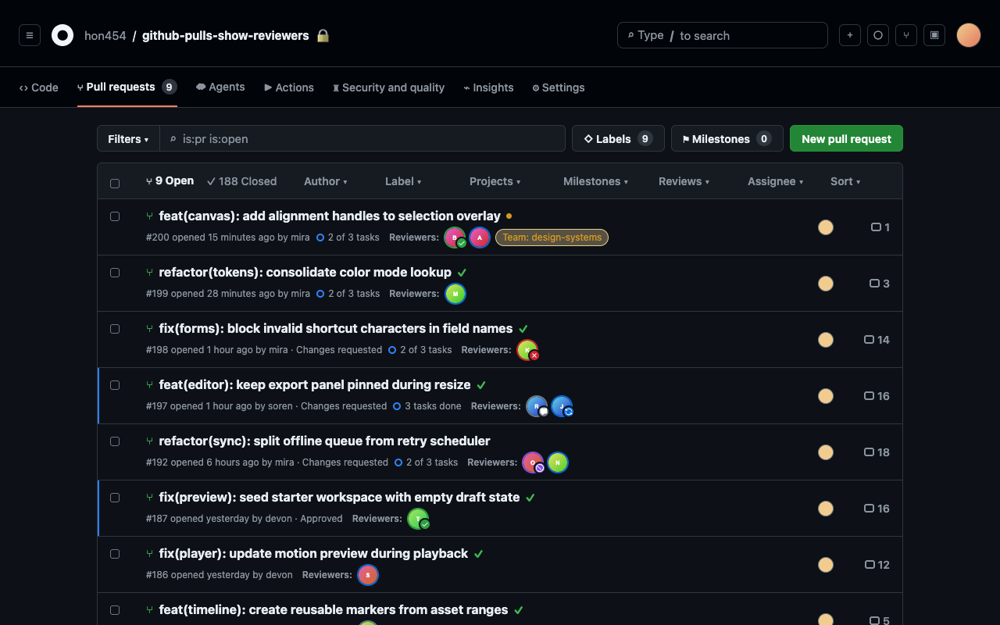
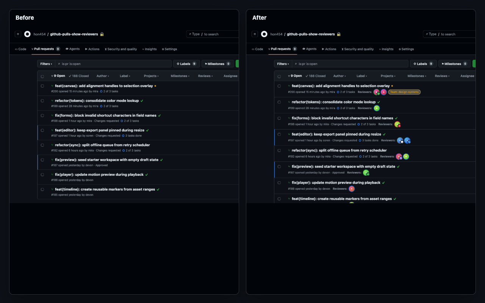

# GitHub Pulls Show Reviewers

[](https://chromewebstore.google.com/detail/github-pulls-show-reviewe/hoocgjopdboeghdkfjlkngkkpbiljggk)
[](https://chromewebstore.google.com/detail/github-pulls-show-reviewe/hoocgjopdboeghdkfjlkngkkpbiljggk)
[](https://github.com/hon454/github-pulls-show-reviewers/actions/workflows/ci.yml)

> See requested reviewers, teams, and completed review state directly in GitHub pull request lists.

`GitHub Pulls Show Reviewers` is a Chrome extension for one focused workflow: make reviewer status visible from the pull request list, so you do not need to open every PR just to see who is requested or how the latest review landed.



## What It Does

- Shows requested user reviewers on GitHub pull request list rows.
- Shows requested team reviewers on GitHub pull request list rows.
- Shows each reviewer's latest completed review state: `approved`, `changes requested`, `commented`, or `dismissed`.
- Links reviewer chips to GitHub PR searches.
- Keeps working as GitHub updates the page during normal navigation.

## Why Use It

GitHub's pull request list is great for scanning titles, authors, and status, but reviewer context can be easy to miss. Without opening each PR, it is hard to tell who is requested, which teams are requested, and how the latest review landed. This extension answers those questions inline by adding a lightweight `Reviewers:` strip to each PR row.



## Install

Install the extension from the [Chrome Web Store](https://chromewebstore.google.com/detail/github-pulls-show-reviewe/hoocgjopdboeghdkfjlkngkkpbiljggk).

After installation, open a GitHub repository's pull request list. Public repositories work without signing in. For private repositories, open the extension options page and add the GitHub account that can access the repository.

## Public and Private Repositories

- **Public repositories:** work without signing in whenever GitHub exposes enough public PR data.
- **Private repositories:** require signing in with GitHub through the extension's GitHub App.
- **Permissions:** the GitHub App requests `Pull requests: Read` only.
- **Organizations:** an organization owner may need to install or approve the GitHub App before private organization repositories can be read.
- **Multiple accounts:** personal and work accounts can be added side by side. The extension picks the matching account for each repository.
- **Session persistence:** sign-in is kept across browser sessions; access tokens are refreshed automatically in the background until you remove the account or revoke the GitHub App.

## Settings

The options page lets you tune the display without changing the core reviewer-focused workflow:

- Show reviewer avatars only, or expand users into `@login` pills.
- Show or hide review-state badges.
- Choose whether reviewer chip links search open PRs only or include closed PRs too.
- Check account and repository access diagnostics for private repositories.


## Privacy

The extension is built around the minimum access needed to show reviewer information on pull request lists.

- Public repository support does not require signing in.
- Private repository support uses GitHub sign-in through the extension's GitHub App.
- The GitHub App requests `Pull requests: Read` only.
- Removing an account from the options page deletes the locally stored token for that account.
- To revoke the GitHub App itself, remove it from GitHub's Applications settings.

See the
[public privacy policy](https://github.com/hon454/github-pulls-show-reviewers/blob/main/docs/privacy-policy.md)
for the full policy text.

## For Contributors

This repository uses WXT, TypeScript, React, zod, Vitest, Playwright, and pnpm.

```bash
pnpm install
pnpm dev
```

`pnpm install` runs `wxt prepare` automatically through pnpm's lifecycle, so no separate prepare step is needed.

Useful validation commands:

```bash
pnpm lint
pnpm typecheck
pnpm test
pnpm test:coverage
pnpm test:e2e
```

Before release packaging or store submission, run:

```bash
pnpm verify:release
pnpm zip
```

`pnpm zip` produces an inspectable build for local verification. Production packaging for the Chrome Web Store uses `pnpm zip:release`, which is a maintainer-only flow documented in [CONTRIBUTING.md](./CONTRIBUTING.md).

For repository workflow, branch naming, commit style, and pull request requirements, see [CONTRIBUTING.md](./CONTRIBUTING.md).

## Documentation

- [Implementation notes](./docs/implementation-notes.md)
- [Manual Chrome testing](./docs/manual-chrome-testing.md)
- [Chrome Web Store notes](./docs/chrome-web-store.md)
- [Chrome Web Store submission packet](./docs/chrome-web-store-submission.md)
- [Privacy policy](./docs/privacy-policy.md)
- [Security policy](./SECURITY.md)
- [Release notes](./docs/releases/)
- [MIT license](./LICENSE)
