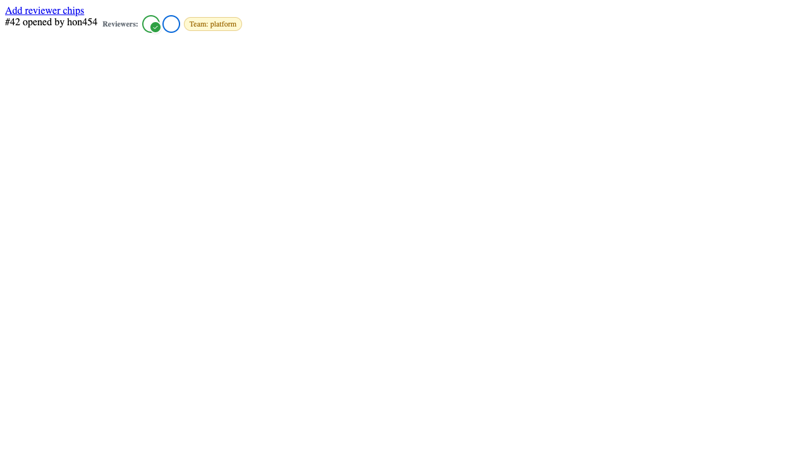
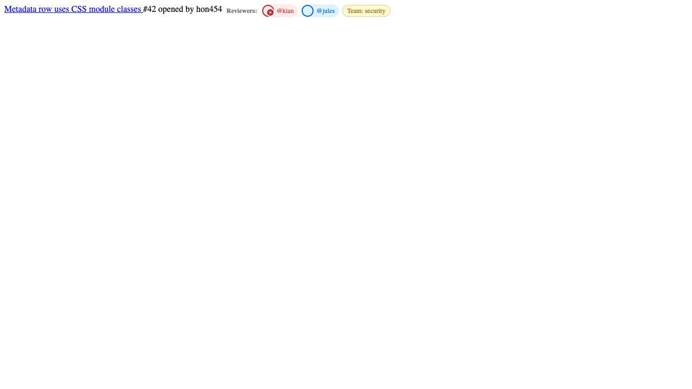
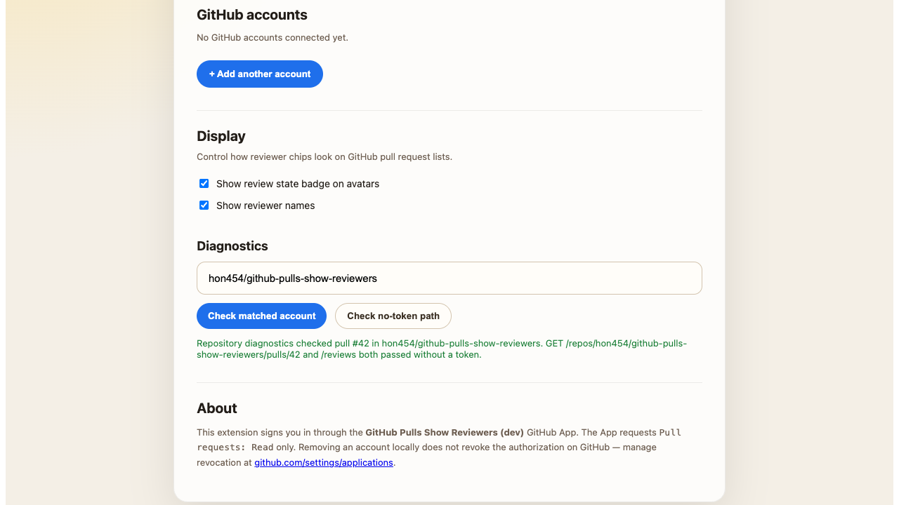

# GitHub Pulls Show Reviewers

> See requested reviewers, teams, and completed review state directly in GitHub pull request lists.

`GitHub Pulls Show Reviewers` is a Chrome extension built for one narrow workflow: make reviewer visibility obvious on GitHub PR list pages without turning the page into a general PR dashboard.



## Why This Exists

On GitHub PR list pages, reviewer context is easy to miss. You often need to open each pull request just to answer basic questions:

- Who is requested?
- Which team is requested?
- Has anyone already reviewed?
- Was the latest review an approval, comment, dismissal, or change request?

This extension brings that information into the list itself with lightweight inline chips. By default it renders an avatar-first `Reviewers:` strip, and the options page can reveal reviewer names or hide the review-state badge without refetching data.

## What The Extension Shows

| Merged `Reviewers` section with state badges | Name-pill layout (optional) |
| --- | --- |
|  |  |

Core behavior:

- Show requested user reviewers on PR list rows
- Show requested team reviewers on PR list rows
- Show each reviewer's latest completed review state
- Keep rendering deterministic with pure view-model helpers and centralized selectors
- Reuse per-page cache entries to avoid duplicate row fetches
- Re-run safely across GitHub SPA navigation and DOM mutations

Review states currently surfaced in the UI:

- `approved`
- `changes requested`
- `commented`
- `dismissed`

## Product Scope

This repository intentionally stays narrow.

- Reviewer visibility first
- Requested reviewers, requested teams, and completed review state are in scope, surfaced as a single `Reviewers:` section with avatar + state-badge chips.
- Display preferences let you hide the state badge or expand each user into an `@login` pill.
- Checks, mergeability, assignees, labels, and dashboard-style expansion are out of scope unless explicitly approved

## Authentication Model

- **Public repositories** continue to work without signing in. See
  [ADR 0001](docs/adr/0001-keep-no-token-support-for-public-repositories.md).
- **Private repositories** require signing in with GitHub through our GitHub App.
  Click **Add account** on the options page and complete the OAuth Device Flow
  (enter the short code on github.com, approve, come back to the options tab).
  The App only requests `Pull requests: Read`. For organization-owned private
  repositories, an organization owner may need to install the GitHub App first.
- **Multiple accounts** are supported. Add a personal account and a work
  account side-by-side; the content script resolves the right one per repo from
  each account's installations.
- **Revocation** happens on GitHub's
  [Applications page](https://github.com/settings/applications). Removing an
  account from the options page only deletes the locally stored token.

See [ADR 0003](docs/adr/0003-github-app-device-flow.md) for the rationale.



## Tech Stack

- `WXT`
- `TypeScript`
- `React` for the options UI
- Manifest V3 Chrome extension
- `zod` for validation
- `Vitest` and `Playwright` for validation coverage
- `pnpm`

## Quick Start

```bash
pnpm install
pnpm prepare
pnpm icons:render
pnpm dev
```

Production build:

```bash
pnpm build
pnpm zip
```

To test the actual built extension in Chrome, load `.output/chrome-mv3` through `chrome://extensions` with `Developer mode` enabled. See [Manual Chrome testing](./docs/manual-chrome-testing.md) for the repository-specific flow.

Validation:

```bash
pnpm lint
pnpm typecheck
pnpm test
pnpm test:e2e
```

For filtered Playwright runs, build once and use the dedicated grep script instead of
passing flags to `pnpm test:e2e`:

```bash
pnpm test:e2e:build
pnpm test:e2e:grep "renders reviewer chips"
```

## Pre-release Test Workflow

Use the same order locally before packaging or store submission:

```bash
pnpm verify:release
```

1. Run `pnpm install` and `pnpm prepare` if dependencies changed or you are on a fresh checkout.
2. Run `pnpm lint` to catch unsafe edits, stale imports, and repository-level style regressions.
3. Run `pnpm typecheck` to verify the extension entrypoints and shared reviewer contracts still line up.
4. Run `pnpm test` to cover selector parsing, reviewer view models, API handling, token diagnostics, and options-page behavior.
5. Run `pnpm test:e2e` to build the MV3 bundle and verify the packaged extension still renders reviewer chips in Playwright fixture scenarios. For filtered Playwright runs, use `pnpm test:e2e:build` and then `pnpm test:e2e:grep "<pattern>"`.
6. Run `pnpm cws:assets` only when screenshots or store-facing visuals need to be regenerated.
7. Run `pnpm zip` only after the checks above are green and you are ready to inspect or submit the packaged artifact.

Release automation installs Playwright Chromium and re-runs `pnpm verify:release` before `pnpm zip`, but the regular PR CI is intentionally lighter. Do not treat a green PR check alone as release sign-off.

## Repository Map

- `entrypoints/content.ts`: content script entrypoint for GitHub PR list pages
- `entrypoints/background.ts`: background lifecycle hooks
- `entrypoints/options/`: options page bootstrapping and UI
- `src/github/`: GitHub routing, selectors, and API access
- `src/features/reviewers/`: reviewer-focused orchestration, DOM rendering, and view models
- `src/storage/`: extension settings
- `src/cache/`: request and page-session caching
- `tests/`: unit, fixture, and end-to-end coverage

## Development Notes

The current MVP is already implemented around a few explicit constraints:

- Separate DOM access from GitHub API access
- Keep selectors centralized in `src/github/selectors.ts`
- Treat GitHub DOM as unstable and prefer fallback-aware parsing
- Keep the content script light and move reusable logic into `src/`
- Prefer fixture-backed regression coverage for GitHub DOM behavior

## Related Docs

- [Implementation notes](./docs/implementation-notes.md)
- [Manual Chrome testing](./docs/manual-chrome-testing.md)
- [Chrome Web Store notes](./docs/chrome-web-store.md)
- [Chrome Web Store submission draft](./docs/chrome-web-store-submission.md)
- [Privacy policy draft](./docs/privacy-policy.md)
- [ADR: Keep no-token support for public repositories](./docs/adr/0001-keep-no-token-support-for-public-repositories.md)
- [ADR: Interim auth (superseded)](./docs/adr/0002-classic-pat-interim-auth.md)
