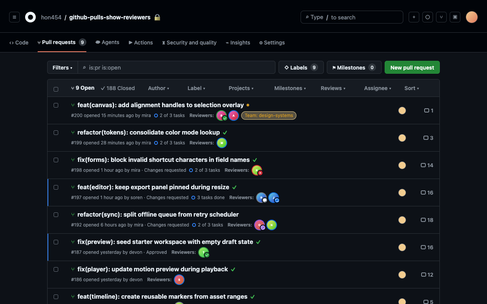
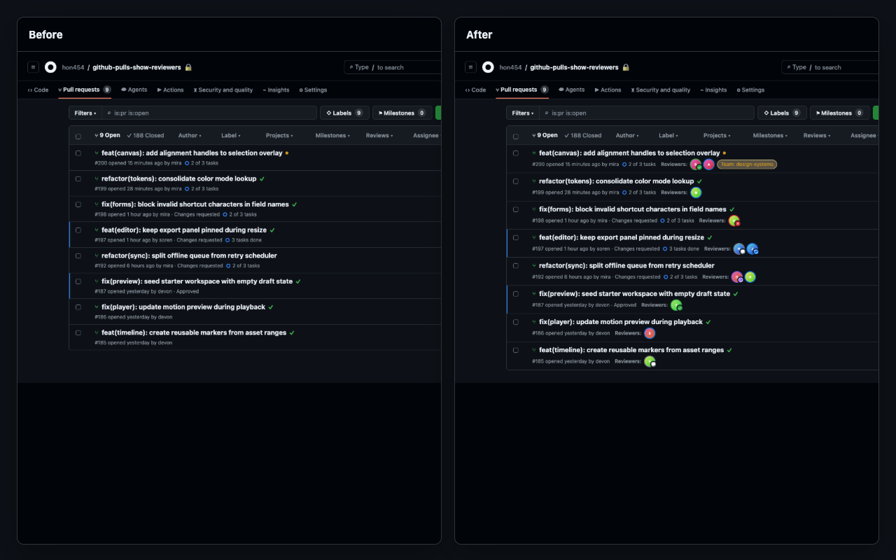
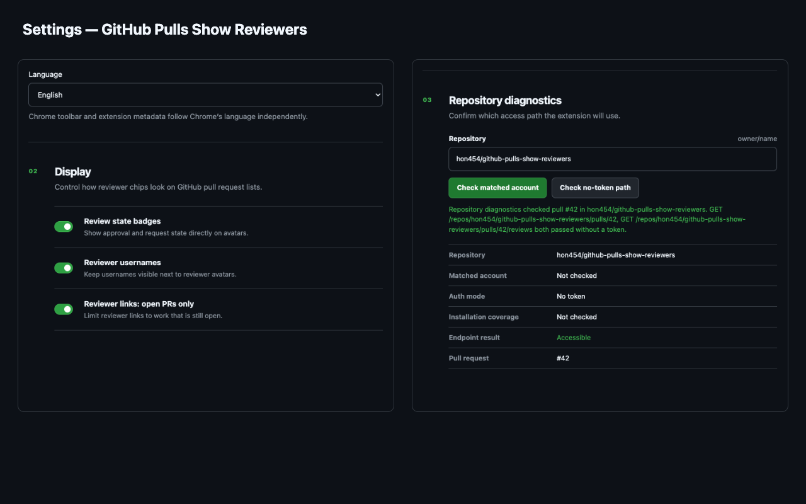

# GitHub Pulls Show Reviewers

[](https://chromewebstore.google.com/detail/github-pulls-show-reviewe/hoocgjopdboeghdkfjlkngkkpbiljggk?utm_source=github&utm_medium=readme_badge&utm_campaign=evergreen)
[](https://chromewebstore.google.com/detail/github-pulls-show-reviewe/hoocgjopdboeghdkfjlkngkkpbiljggk?utm_source=github&utm_medium=readme_badge&utm_campaign=evergreen)
[](https://github.com/hon454/github-pulls-show-reviewers/actions/workflows/ci.yml)

> See requested reviewers, teams, and completed review state directly in GitHub pull request lists.

`GitHub Pulls Show Reviewers` is a Chrome extension for one focused workflow: make reviewer status visible from the pull request list, so you do not need to open every PR just to see who is requested or how the latest review landed.

[See the 30-second product tour](https://hon454.github.io/github-pulls-show-reviewers/).



## What It Does

- Shows requested user reviewers on GitHub pull request list rows.
- Shows requested team reviewers on GitHub pull request list rows.
- Shows each reviewer's latest completed review state: `approved`, `changes requested`, `commented`, or `dismissed`.
- Links reviewer chips to GitHub PR searches.
- Reuses page-level reviewer metadata across visible rows, including searched
  or paginated pull request lists when GitHub's REST pagination exposes those
  rows.
- Keeps working as GitHub updates the page during normal navigation.
- Keeps reviewer metadata visible in narrow desktop and split-window layouts
  without restoring GitHub metadata that GitHub intentionally hides there.
- Leaves rows visually unchanged when a pull request has no reviewers. If a
  reviewer request fails unexpectedly, shows one page-level reload prompt and
  keeps any previously loaded reviewer chips visible.

## Why Use It

GitHub's pull request list is great for scanning titles, authors, and status, but reviewer context can be easy to miss. Without opening each PR, it is hard to tell who is requested, which teams are requested, and how the latest review landed. This extension answers those questions inline by adding a lightweight `Reviewers:` strip to each PR row.



## Install

Install the extension from the [Chrome Web Store](https://chromewebstore.google.com/detail/github-pulls-show-reviewe/hoocgjopdboeghdkfjlkngkkpbiljggk?utm_source=github&utm_medium=readme&utm_campaign=evergreen).

After installation, open a GitHub repository's pull request list. Public repositories work without signing in. For private repositories, open the extension options page and add the GitHub account that can access the repository.

## Browser and Language Support

Chrome is the only browser this extension currently supports and tests. Other
Chromium-family browsers such as Edge, Brave, and Arc may be able to run the
same MV3 build, but they are not release targets today and are not covered by
the manual Chrome verification flow. Firefox support is also out of scope until
its MV3 behavior, extension packaging, and GitHub sign-in flow are tested
explicitly.

Chrome metadata, options, sign-in, repository diagnostics, reviewer chips, and
access banners support English, Korean, Japanese, Simplified Chinese, and
Traditional Chinese.

## Public and Private Repositories

- **Public repositories:** work without signing in whenever GitHub exposes enough public PR data.
- **Private repositories:** require signing in with GitHub through the extension's GitHub App.
- **Permissions:** the GitHub App requests `Pull requests: Read` only.
- **Repository access:** if a signed-in private repository is not covered by the
  GitHub App installation, the extension prompts you to configure App access
  for that owner/repository.
- **Organizations:** an organization owner may need to install or approve the GitHub App before private organization repositories can be read.
- **Multiple accounts:** personal and work accounts can be added side by side. The extension picks the matching account for each repository.
- **Session persistence:** sign-in is kept across browser sessions; access tokens are refreshed automatically in the background until you remove the account or revoke the GitHub App.

## Settings

The options page lets you tune the display without changing the core reviewer-focused workflow:

- Show reviewer avatars only, or expand users into `@login` pills.
- Show or hide review-state badges.
- Choose whether reviewer chip links search open PRs only or include closed PRs too.
- Check account, repository access, installation coverage, and rate-limit diagnostics for private repositories.



## Privacy

The extension is built around the minimum access needed to show reviewer information on pull request lists.

- Public repository support does not require signing in.
- Private repository support uses GitHub sign-in through the extension's GitHub App.
- The GitHub App requests `Pull requests: Read` only.
- Removing an account from the options page deletes the locally stored token for that account.
- To revoke the GitHub App itself, remove it from GitHub's Applications settings.

See the
[public privacy policy](https://github.com/hon454/github-pulls-show-reviewers/blob/main/docs/privacy-policy.md)
for the full policy text.

## For Contributors

This repository uses WXT, TypeScript, React, zod, Vitest, Playwright, and pnpm.

```bash
pnpm install
pnpm dev
```

`pnpm install` runs `wxt prepare` automatically through pnpm's lifecycle, so no separate prepare step is needed.

Useful validation commands:

```bash
pnpm lint
pnpm typecheck
pnpm test
pnpm test:coverage
pnpm test:e2e
```

Before release packaging or store submission, run:

```bash
pnpm verify:release
pnpm zip:release
```

`pnpm zip` produces an inspectable local build only. Production packaging for the Chrome Web Store uses `pnpm zip:release`, which loads the maintainer GitHub App identifiers and verifies the final zip before upload.

Pushing a new `v<version>` tag attaches the verified package to a GitHub Release
and submits it through CWS API v2 for automatic publication after normal review.
For new listing languages, the manual `upload-only` and `submit-existing` stages
allow a pause to register descriptions/screenshots; neither creates a GitHub
Release. The later tag reuses the original checked package and skips CWS writes
when its exact source receipt is already pending or published. With the updated
workflow, manual `skip` remains safe against a tag, and credential-only `dry-run`
never creates a release or changes store state. Legacy tags retain their old
workflow: select updated `main` or a reviewed branch as the control ref and pass
an old package tag through the separate `tag` input. See [Chrome Web Store notes](./docs/chrome-web-store.md)
and the [agent handoff runbook](./docs/cws-agent-handoff.md) for inputs, provenance,
fresh dashboard evidence, and uncertain-outcome recovery.

For repository workflow, branch naming, commit style, and pull request requirements, see [CONTRIBUTING.md](./CONTRIBUTING.md).

## Documentation

- [Implementation notes](./docs/implementation-notes.md)
- [Manual Chrome testing](./docs/manual-chrome-testing.md)
- [Chrome Web Store notes](./docs/chrome-web-store.md)
- [Chrome Web Store submission packet](./docs/chrome-web-store-submission.md)
- [Staged CWS agent handoff](./docs/cws-agent-handoff.md)
- [Store acquisition attribution](./docs/growth/attribution.md)
- [Launch and community copy](./docs/growth/launch-kit.md)
- [Privacy policy](./docs/privacy-policy.md)
- [Security policy](./SECURITY.md)
- [Release notes](./docs/releases/)
- [MIT license](./LICENSE)

## Localization

The localization foundation supports English (fallback), Korean, Japanese,
Simplified Chinese and Traditional Chinese. Chrome metadata follows Chrome's
language. The local `language` preference defaults to `auto` and supports a
manual override for extension-owned UI. The options page, display settings,
account actions and GitHub device sign-in flow support all five languages.
Changing language updates other open options tabs without restarting sign-in,
clearing repository input or repeating an account action. Repository diagnostics
reformat existing results and running status without another API request.
Reviewer labels, loading status, tooltips, accessible names, and access banners
update on open PR lists without fetching data again or restarting queued work.
Dismissed banners stay dismissed. GitHub content, reviewer identifiers, search
links, and the existing review-state colors, badges, and precedence are unchanged.
Product and GitHub App names remain unchanged. See the
[localization contract](./docs/adr/0006-bundled-localization-and-render-only-language.md)
for the manifest/UI boundary and shared APIs, and the
[five-language glossary and QA report](./docs/localization.md) for translation
coverage, packaged tests and native browser-language limitations.
